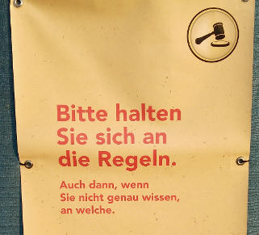

# Reveal.js template with Puzzle theme
John Deer
<!-- .slide: class="master01" -->


<!-- section -->
# Agenda
* First
* Second
* Third
* Conclusion

<!-- .slide: class="master02" -->


<!-- section -->
# First
<!-- .slide: class="master03" -->


<!-- slide -->
## Some Code
``` Kotlin
fun main(args: Array<String>): Unit {
 val name = "Puzzle"
 println("Hi $name!")
}
```

<!-- slide -->
## Fragments
* Bullet point
* Bullet point <!-- .element: class="fragment" -->
* Bullet point <!-- .element: class="fragment" -->




<!-- slide -->
## Fragments with index
<div class="fragment" data-fragment-index="1">
<li> First
</div>

``` Kotlin
var a: String? = "Hello"
```
<!-- .element: class="fragment" data-fragment-index="1" -->

<div class="fragment" data-fragment-index="2">
<li> Second
</div>

``` Kotlin
var b: String? = "World"
```
<!-- .element: class="fragment" data-fragment-index="2" -->


<!-- section -->
# Second
<!-- .slide: class="master04" -->

<!-- slide -->
## Text
Some text

<small>Small text</small>

_Italic text_

**Bold text**


<!-- slide -->
## Floating image


Some text right of the picture


<!-- section -->
# Third
<!-- .slide: class="master05" -->


<!-- section -->
# Conclusion
<!-- .slide: class="master01" -->


<!-- slide -->
## Why Reveal
* Easy
* Cool


<!-- 
# References
* Image: (c) 2018 John Deer
 -->
